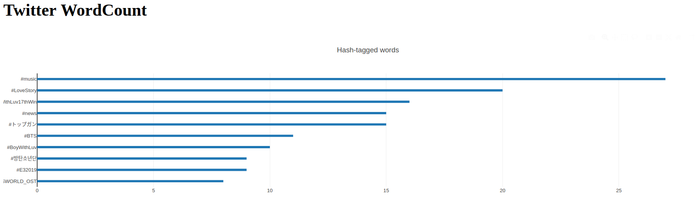

# Count Words from Twitter Using SparkStream
- Prerequisite: spark 2.4.0, kafka 2.2
- **Producer**: `kafka-connect-twitter`(https://github.com/Eneco/kafka-connect-twitter)
	- it has no more update and need to edit few file:
		- `connect-sink-standalone.properties`
  		- `connect-source-standalone.properties`
  		- `pom.xml`
	- Please refer to https://github.com/Eneco/kafka-connect-twitter/pull/56/files for details.
	- I made repo with modified file for the purpose of study 
- **Consumer**
	- SparkStream
		- `kafka_sparkstream.py`: processing data by spark_stream
- `kafka_app.py`: deploy flask & dash server 
- Result


## Implementation
Clone this repo, fill `twitter-source.properties` with your info and follow the code below:
~~~
# example code
## run zookeeper server(terminal1)
$ kafka/bin/zookeeper-server-start.sh config/zookeeper.properties

## run kafka server(terminal2)
$ kafka/bin/kafka-server-start.sh config/server.properties

## create topic: twitter(terminal3)
$ kafka/bin/kafka-topics.sh --create --bootstrap-server localhost:9092 --replication-factor 1 --partitions 1 --topic twitter

## check the topic
$ kafka/bin/kafka-topics.sh --list --bootstrap-server localhost:9092
>> twitter

## set the PATH(terminal4)
$ export CLASSPATH=path/to/kafka-connect-twitter/target/kafka-connect-twitter-0.1-jar-with-dependencies.jar

## run twitter stream
$ path/to/kafka/bin/connect-standalone.sh path/to/kafka-connect-twitter/connect-simple-source-standalone.properties path/to/kafka-connect-twitter/twitter-source.properties

## mine
$ /home/henry/kafka/bin/connect-standalone.sh 

# run flask and dash server 
$ python3 kafka_app.py

# run spark_stream
$ path/to/spark/spark-submit --packages org.apache.spark:spark-sql-kafka-0-10_2.11:2.4.0 kafka_sparkstream.py
~~~


# kafka

- 분산처리가 가능한 고성능 메세지 큐(streaming data를 저장/읽기/분석을 가능하게 함)
- kafka는 Broker의 역할
- Topic안에 partition 기능 존재
  - partition안에서는 순서 바뀌고, b/w partition은 순서 보장(유지)
    
- 특징
  - file copy 불필요
  - delay되지 않도록, 저장되기 전 consumer에 뿌려줘야 함. 
  - 메세지를 디스크에 저장. 유실없음.
  - 메세지 중복/유실 문제
        - trade-off
        - 유실 안하려면 중복 vs 중복 안하면 유실 위험
        - default: At least once(유실 회피)
- 구조
  - cluster형식으로 실행
  - Kafka cluster는 `topic`의 records stream을 저장
  - record는 key, value, timestamp로 구성됨
- 핵심 API: Producer/Consumer/Streams/Connector API
  
  - Producer API: App이 steram of records를 Kafka Topic으로 전송하도록 함
  - Consumer API: App이 topic을 subscribe하고 stream of records를 처리하도록 함
  - Streams API: App이 stream processor 역할을 하도록 함. stream processor는 topic의 input stream을 받아 transform하여 output stream 생성  
  - Connector API: Kafka topic을 현재 app 또는 data system에 연결하는 producers/consumers를 실행하도록 함. eg. RDB에 연결된 Connector는 table의 모든 변경사항을 capture

------

# Tutorial: twitter stream을 kafka로 받아오기

#### kafka 실행

- install

```
$ curl "http://www-eu.apache.org/dist/kafka/1.1.0/kafka_2.12-1.1.0.tgz" -o ~/Downloads/kafka.tgz
# 신규버전
http://mirror.navercorp.com/apache/kafka/2.2.0/kafka_2.12-2.2.0.tgz
$ mkdir ~/kafka && cd ~/kafka
$ tar -xvzf ~/Downloads/kafka.tgz --strip 1
```

- zookeeper & server 실행
  - zookeeper가 서버 매니징

```
#link 2.2 ver: https://kafka.apache.org/quickstart
#link 2.1 ver: https://kafka.apache.org/21/documentation.html#producerconfigs

# start server
## terminal1
$ bin/zookeeper-server-start.sh config/zookeeper.properties

## terminal2
$ bin/kafka-server-start.sh config/server.properties

# create a topic
## terminal3 
$ bin/kafka-topics.sh --create --bootstrap-server localhost:9092 --replication-factor 1 --partitions 1 --topic test

#!! 2.1 versino
bin/kafka-topics.sh --create --zookeeper localhost:2181 --replication-factor 1 --partitions 1 --topic test

10.146.0.32

bin/kafka-console-consumer.sh --zookeeper master.server:2181 --topic test --from-beginning

# create producer
## terminal4
bin/kafka-console-producer.sh --broker-list localhost:9092 --topic test
>> This is a message
>> This is another message

# create consumer
## terminal5
bin/kafka-console-consumer.sh --bootstrap-server localhost:9092 --topic test --from-beginning
>> This is a message
>> This is another message
```

- 정리: producer(console) - kafka(zookeeper) - consumer(console)
  - 각 단계에서 test topic create - subscribe  

#### twitter 설정

- install `twitter connector`
- https://github.com/Eneco/kafka-connect-twitter
  - install mvn `mvn clean package`

```
export PATH=/home/renwenxue0/Downloads/apache-maven-3.6.1

$ export M2_HOME=/usr/local/apache-maven/apache-maven-3.3.9
$ export M2=$M2_HOME/bin
$ export PATH=$M2:$PATH
```

```
- export CLASSPATH=`pwd`/target/kafka-connect-twitter-0.1-jar-with-dependencies.jar
- `$CLASSPATH=/home/renwenxue0/kafka-connect-twitter/target/kafka-connect-twitter-0.1-jar-with-dependencies.jar`
```

```
export KAFKA=카프카_다운로드_받은_경로 `pwd`: /home/renwenxue0/kafka
$KAFKA/bin/connect-standalone.sh connect-simple-source-standalone.properties twitter-source.properties

or
`$CLASSPATH=/home/renwenxue0/kafka-connect-twitter/target/kafka-connect-twitter-0.1-jar-with-dependencies.jar`

/home/renwenxue0/kafka/bin/connect-standalone.sh connect-simple-source-standalone.properties twitter-source.properties
```

- 설정파일 만들기

```
$ cp twitter-source.properties.example twitter-source.properties
```

- key 토큰 받기
  - 트위터 스트림 받기: https://dev.twitter.com/streaming/overview 

```
$ vim twitter-source.properties
```

twitter.consumerkey=TICJKxNvL5fQhYrostbflIggj
twitter.consumersecret=GPDk9PUvr10cT4OsithBwMdb5ldVZ7us1SqPuGJtDxEU4IUD1w
twitter.token=1114320343185801216-rw3frSyqMpRUkp0wjSzIRn9Sp3SpWy
twitter.secret=5NShIKqAb96vN3zrevBR0rdbKbHyXhADjUlvrEK1pVhxi

- **중요: outdated된 code 최신화 필요**(https://github.com/Eneco/kafka-connect-twitter/pull/56/files)  
  - `connect-sink-standalone.properties`
  - `connect-source-standalone.properties`
  - `pom.xml`
  - `src/main/scala/com/eneco/trading/kafka/connect/twitter/TwitterSourceConnector.scala`
- 다시 build `mvn clean package`

## 실행(3가지)

- kafka: connect-standalone.sh 
- kafka-connect-twitter: connect-simple-source-standalone.properties & twitter-source.properties

```
$ cd kafka-connect-twitter
$ $KAFKA/bin/connect-standalone.sh connect-simple-source-standalone.properties twitter-source.properties
```

------

### 추가

- 실행파일 jar - zip파일 압축파일임
- build: 소스코드를 실행 가능한 상태로 만들기 
  - 소스코드를 컴파일하면 실행파일이 나옴
- `maven`: 빌드해야할 코드가 너무 많고 다른 pjt코드도 가져와야 할 때 사용

--- 아래 해결필요

### submit

$ spark-submit org.apache.spark:

### 중요

- twitter property에 Twiterconnector 붙였음
  왜 고성능이어야 함?

### trouble shooting

## 1.

pom.xml 과 TwitterSourceConnector.scala 파일을 수정
후 다시 빌드 (mvn clean package)

## 2.

twitter-source.properties 파일의 다음 항목을 수정
output.format=string 주석 해제
track.terms=... 라인 주석 해제

후 $KAFKA/bin/connect-standalone.sh connect-simple-source-standalone.properties twitter-source.properties 실행 ($CLASSPATH 잘 되어있는지도 체크해야 함 )

## 3.

- run hashtag ranking

```
./pyspark --packages org.apache.spark:spark-sql-kafka-0-10_2.11:2.4.0

../../spark-2.4.0-bin-hadoop2.7/bin/spark-submit --packages org.apache.spark:spark-sql-kafka-0-10_2.11:2.4.0 hashtag_ranking.py
```
~~~

~~~
